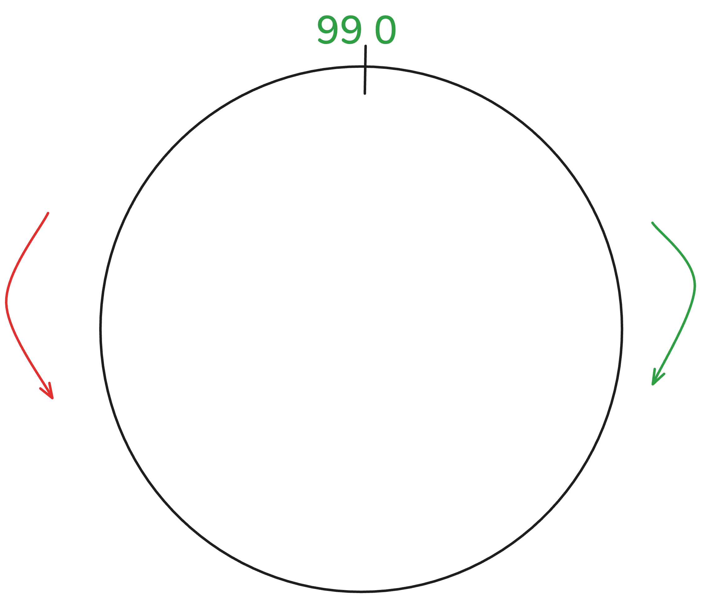

# Solution Explanation

## Part 1

### Approach
I noticed that on each dial rotation, I either add a value in the case of R (right) or subtract a value in the case of L (left).

You can see it as a circle:

In the case of an R rotation, there are two cases: < 99 or > 99.

< 99 is obvious within the circle.

> 99 is like making a rotation over the whole circle. To correct the overlap, we have to subtract the whole circle from the current value, which means currVal - 100 (including 0).

In the case of an L rotation, there are two cases: positive or negative.

positive is obvious within the circle.

negative is the same as the > 99 case but in reverse—so instead of subtracting 100, we must add it: currVal + 100.

To generalize the solution, for each rotation instruction I extract the rotation value, perform a modulo of 100 on it to get rid of the circular overlap, and multiply it by the rotation type (L: -1, R: 1).
Depending on the value, I add/subtract 100, and each time I get a result of 0, I increment the password value.

### Complexity

- **Time Complexity:** O(N) — where N is the number of lines in the input. The calculation for each line is constant time.
- **Space Complexity:** O(1) — Only a few integer variables are used.
